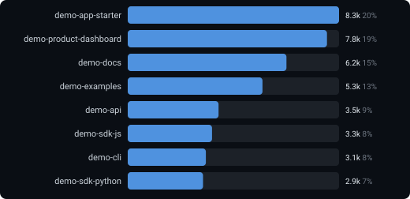

> **Public synthetic demo.** This repository is generated as a Reponomics showcase. The dashboard data is synthetic, the committed README dashboard is demo-only, and the Pages dashboard key is intentionally public.

# Reponomics Dashboard

<!-- Workflow badge hidden pending a deliberate dashboard status design. -->
<!--

-->

  [View latest updates](docs/reponomics/README.md)

Latest data capture: 2026-09-05 12:00 UTC

<picture>
  <source media="(prefers-color-scheme: light)" srcset="docs/assets/hero-stats-light.svg">
  
</picture>

⭐ Best overall day: **711 views** (43d ago) &nbsp;·&nbsp; 🏆 Best single-repo day: **`demo-product-dashboard`** 219 on 2026-07-23

**Growth (14d):** attention **40,492 views** / **22,178 visitors**; interest **+23 stars** / **+4 watchers** (now 472 / 117); adoption **5,339 clones** / **+3 forks** (now 61).

### Views Trend

<picture>
  <source media="(prefers-color-scheme: light)" srcset="docs/assets/sparkline-light.svg">
  
</picture>

### Activity

<picture>
  <source media="(prefers-color-scheme: light)" srcset="docs/assets/activity-light.svg">
  
</picture>

<strong>Top Repositories &amp; Share</strong>

<picture>
  <source media="(prefers-color-scheme: light)" srcset="docs/assets/bar-chart-light.svg">
  
</picture>

<picture>
  <source media="(prefers-color-scheme: light)" srcset="docs/assets/donut-light.svg">
  
</picture>

### Insights

- `reponomics-demo/demo-examples` views +9% over the last 7d (442 -> 483, +41).
- `reponomics-demo/demo-docs` views +3% over the last 7d (578 -> 593, +15).
- `reponomics-demo/demo-product-dashboard` views -3% over the last 7d (587 -> 572, -15).

<strong>Repositories</strong> &mdash; top 8 of 8

| Repository | Views | Visitors | Clones | Cloners |
|------------|------:|---------:|-------:|--------:|
| reponomics-demo/demo-app-starter | 8,274 | 4,258 | 1,033 | 550 |
| reponomics-demo/demo-product-dashboard | 7,827 | 4,218 | 743 | 392 |
| reponomics-demo/demo-docs | 6,223 | 3,504 | 142 | 50 |
| reponomics-demo/demo-examples | 5,287 | 3,102 | 1,113 | 601 |
| reponomics-demo/demo-api | 3,561 | 2,162 | 380 | 155 |
| reponomics-demo/demo-sdk-js | 3,303 | 1,670 | 557 | 288 |
| reponomics-demo/demo-cli | 3,066 | 1,703 | 815 | 423 |
| reponomics-demo/demo-sdk-python | 2,951 | 1,561 | 556 | 287 |

<strong>Repository Growth</strong> &mdash; top 8 by growth

| Repository | Attention | Interest growth | Adoption growth |
|------------|----------:|----------------:|----------------:|
| `reponomics-demo/demo-app-starter` | 8,274 views / 4,258 visitors | +4 stars (43) / +1 watchers (10) | 1,033 clones / +1 forks (6) |
| `reponomics-demo/demo-product-dashboard` | 7,827 views / 4,218 visitors | +4 stars (49) / +1 watchers (12) | 743 clones / +1 forks (7) |
| `reponomics-demo/demo-docs` | 6,223 views / 3,504 visitors | +3 stars (51) / +1 watchers (13) | 142 clones / +1 forks (7) |
| `reponomics-demo/demo-examples` | 5,287 views / 3,102 visitors | +3 stars (56) / +1 watchers (14) | 1,113 clones / +0 forks (7) |
| `reponomics-demo/demo-api` | 3,561 views / 2,162 visitors | +3 stars (59) / +0 watchers (14) | 380 clones / +0 forks (7) |
| `reponomics-demo/demo-sdk-js` | 3,303 views / 1,670 visitors | +2 stars (65) / +0 watchers (16) | 557 clones / +0 forks (8) |
| `reponomics-demo/demo-cli` | 3,066 views / 1,703 visitors | +2 stars (78) / +0 watchers (20) | 815 clones / +0 forks (10) |
| `reponomics-demo/demo-sdk-python` | 2,951 views / 1,561 visitors | +2 stars (71) / +0 watchers (18) | 556 clones / +0 forks (9) |

<strong>Top Referrers</strong> &mdash; 8 sources

| Referrer | Views | Uniques |
|----------|------:|--------:|
| github.com | 2,750 | 1,673 |
| google.com | 1,777 | 1,080 |
| docs.github.com | 1,048 | 636 |
| news.ycombinator.com | 644 | 389 |
| reddit.com | 481 | 289 |
| stackoverflow.com | 401 | 241 |
| npmjs.com | 320 | 191 |
| pypi.org | 238 | 140 |

<strong>Popular Content</strong> &mdash; top 10 paths

| Repository | Content | Views | Uniques |
|------------|---------|------:|--------:|
| `reponomics-demo/demo-app-starter` | Repository overview | 551 | 314 |
| `reponomics-demo/demo-product-dashboard` | Repository overview | 521 | 296 |
| `reponomics-demo/demo-docs` | Repository overview | 414 | 235 |
| `reponomics-demo/demo-examples` | Repository overview | 352 | 200 |
| `reponomics-demo/demo-app-starter` | README | 248 | 141 |
| `reponomics-demo/demo-api` | Repository overview | 237 | 135 |
| `reponomics-demo/demo-product-dashboard` | README | 234 | 133 |
| `reponomics-demo/demo-sdk-js` | Repository overview | 220 | 125 |
| `reponomics-demo/demo-cli` | Repository overview | 204 | 116 |
| `reponomics-demo/demo-sdk-python` | Repository overview | 196 | 111 |

---

[Setup & Docs](docs/reponomics/README.md)

Generated by [Reponomics Dashboard Template](https://github.com/reponomics/reponomics-dashboard)
